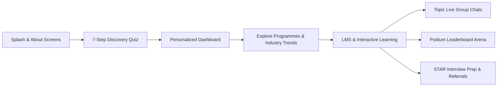

# SHE STARTS (Mentra) 🚀
### *Career Restart & Guided Learning Platform for Returning Professionals*

[](https://adm04.github.io/Mentra/)
[](https://adm04.github.io/Mentra/)
[](https://adm04.github.io/Mentra/)

---

## 🌟 Overview

**SHE STARTS (Mentra)** is an empathetic, gamified, mobile-first career restart and guided learning platform built for professionals returning to the workforce after career breaks (caregiving, family relocation, parental leave, health pauses, sabbaticals, or industry transitions).

The application delivers a judgment-free, structured pathway from initial diagnostic assessment to practical job-ready competency, live peer discussions, and employer referrals.

🔗 **Live Deployment:** [https://adm04.github.io/Mentra/](https://adm04.github.io/Mentra/)

---

## ✨ Key Features & Flow Architecture



### 1. 📋 7-Step Career Discovery Quiz
- **Diagnostic Personalization:** Captures current career break duration (6 mos to 10+ yrs), reason, prior background, tech comfort, English fluency, and weekly commitment.
- **Friction-Free & Reassuring:** Automatic floating reassurance pills trigger every 2–3 selections to alleviate return-to-work anxiety (*"4,200+ professionals with this background restarted with Mentra"*).
- **Simulated Diagnostic Processing:** Multi-stage animated engine compiling personalized learning paths in real time.

### 2. 📊 Personalized Comeback Dashboard
- **RESET → REBUILD → RESTART Journey Tracker:** Visual 3-phase progression nodes.
- **Explainable Readiness Score (62%):** Interactive breakdown modal detailing goal clarity, family support, skill transferability, and next steps.
- **Dynamic 12-Card Profile Snapshot:** Real-time reflection of quiz responses.

### 3. 📈 Course Discovery & Booming Industry Insights
- **Growth Trend Card:** Integrated vector SVG upward trend curve highlighting **+28% YoY remote hiring growth** and 120,000+ open opportunities.
- **Curriculum Roadmaps:** 8-week module breakdown with clear weekly deliverables.
- **Low-Friction 2-Day Free Trial:** Access lesson 1 and first brand assignment before financial commitment.

### 4. 🎓 Guided LMS & Assignment Workbench
- **Interactive Video Player:** Seek bar, playback controls, and full-screen player mode.
- **Hands-On Assignment Submissions:** File upload simulator and URL attachment for Figma/Notion submissions with mentor review statuses.
- **Live Doubt Clearing Classrooms:** Schedule and live room join integration.

### 5. 💬 Topic-Based Live Group Chats
- **Open Channels:** `#career-comebacks`, `#digital-marketing`, `#interview-prep`, `#daily-wins`, `#wfh-jobs`.
- **Real-Time Experience:** Dynamic online presence counters, interactive messaging dock (Enter key support), simulated peer auto-replies, and multi-emoji reaction counts (`👍`, `❤️`, `🔥`, `🚀`, `💡`).
- **Dual Mode:** Instant toggle between **💬 Live Chats** and **📝 Discussion Feed**.

### 6. 🏆 Gamified Cohort Leaderboard Arena
- **Top 3 Podium:** 🥇 1st Place Rohan Verma (1,240 XP), 🥈 2nd Place Alex/Minakshi (1,180 XP), 🥉 3rd Place Priya Sharma (1,050 XP).
- **Timeframe Toggles:** This Week, Monthly, and All-Time XP scaling.
- **Badge Showcase:** Earned trophies for streaks, quiz mastery, and assignment completions.
- **Direct Navigation:** Dedicated bottom nav tab and homepage widget teaser.

### 7. 🎯 STAR Interview Prep & Career Acceleration
- **Mock Interview Simulator:** Rehearsal studio with real questions and STAR framework tips.
- **ATS Resume Polish Guide:** Actionable templates for framing 2–5 year career pauses.
- **Verified WFH Opportunities:** Direct mentor referral request flows.

---

## 🎨 Design System & Brand Identity

- **Visual Palette (Extracted from SheStarts Gradient):**
  - **Brand Pink:** `#FA4D87` / `#FF5E97`
  - **Brand Purple / Violet:** `#8B5CF6` / `#7C3AED`
  - **Brand Gradient:** `linear-gradient(135deg, #FA4D87 0%, #7C3AED 100%)`
  - **Vertical Gradient:** `linear-gradient(180deg, #FA4D87 0%, #7C3AED 100%)`
- **Typography:** Modern geometric sans-serif **Manrope** + monospace **JetBrains Mono** via Google Fonts.
- **Spatial Grid:** Strict 8px spacing rhythm with soft shadows (`--shadow-md`), rounded cards (`--radius-lg`), and glassmorphism backdrops.
- **Mobile-First Layout:** Optimized for 390px iPhone viewport with top reviewer navigation toolbar.

---

## 💻 Tech Stack & Architecture

- **Core:** Pure HTML5 Semantic Elements
- **Styling:** Modular Vanilla CSS3 (Custom CSS Properties / Variables, Flexbox, CSS Grid)
- **Logic & State:** Vanilla JavaScript ES6+ (Reactive state store `appState`, DOM event handlers, chat stream simulation)
- **Icons & Graphics:** Clean inline SVG icons (Heroicons & custom vector trend illustrations)
- **Zero Build Dependencies:** Runs instantly in any modern browser without npm build step overhead.

---

## 🚀 Running Locally

### Option 1: Direct File
Simply double-click or open `index.html` in any web browser:
```bash
start index.html
```

### Option 2: Local HTTP Server (Python)
```bash
# Clone the repository
git clone https://github.com/adm04/Mentra.git
cd Mentra

# Start local server
python -m http.server 8080
```
Then visit **`http://localhost:8080`** in your browser.

---

## 📱 Reviewer Controls

Use the top **Reviewer Toolbar** on larger screens to instantly jump to any step in the user journey:
- `Splash` → `About 1` → `About 2` → `Quiz 1–6` → `Dashboard` → `Explore` → `LMS` → `Leaderboard` → `Community` → `Interview`

---

## 📄 License
This project is open-source and available under the [MIT License](LICENSE).
